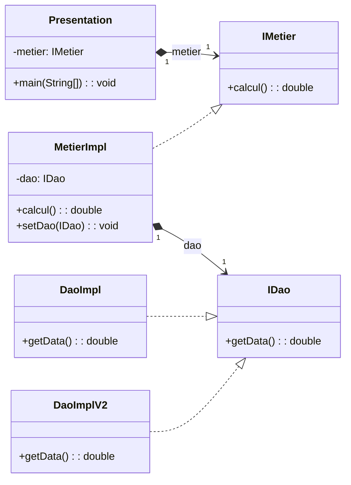

# SPRING_IOC_AOP

* IoC : Inversion of Control (Inversion de Contrôle)
* AOP : Aspect-Oriented Programming (Programmation Orientée Aspect)
* Couplage fort: Classe depend d'une autre classe
* Couplage faible: Classe depend d'une interface

## TD_1

### 

